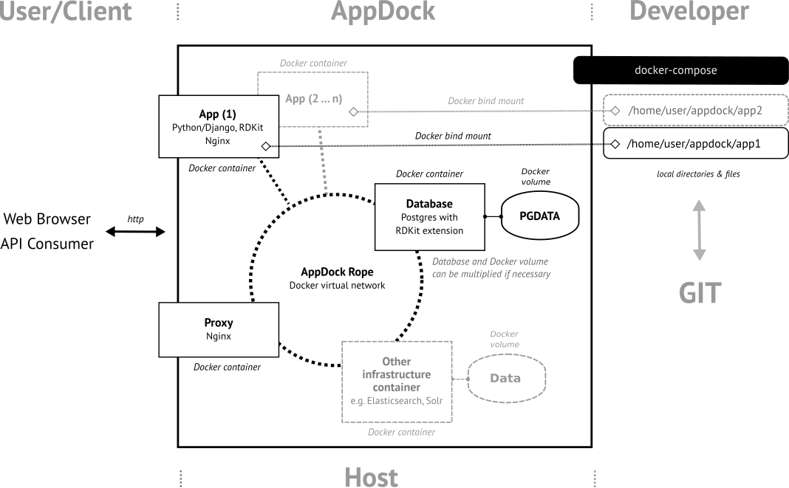

AppDock
=======

Overview
--------

**AppDock** is a `Docker <https://docs.docker.com/>`_ based platform intended for the rapid development of scientific
web applications and microservices. At its current (early) development stage it specifically supports the quick
development of `python <https://www.python.org/>`_/`Django <https://www.djangoproject.com/>`_ based services.
Because its development was started with a cheminformatic-centric focus in mind, AppDock includes
`RDKit <http://www.rdkit.org/>`_ both at its core application container for the development of the
python/Django-based components, as well as database extension of the `Postgres <https://www.postgresql.org/>`_
database container. The following schema provides an overview.

Requirements
------------

Please have at least `Docker CE 17.09 <https://docs.docker.com/engine/installation/>`_ and `Docker Compose 1.17 <https://docs.docker.com/compose/install/>`_ installed on your system.

Installation (Outdated)
-----------------------

Clone this repository::

    https://github.com/markussitzmann/appdock.git appdock

go into directory ::

    cd appdock/

and edit the file ``.env`` to appropriate settings, in particular, variable ``APPDOCK_HOME`` to a file directory location where the user
running the build in the next is allowed to create a directory. If the directory specified in ``APPDOCK_HOME`` does not exist, it will be
created during the first start up of a Docker container. It will be mounted as volume in all containers.

Start the Docker build of the system by going to the ``build``-directory of the ``appdock``-directory and run ``docker-compose build`` (it is
actually important to be in this directory because ``docker-compose`` needs the corresponding ``docker-compose.yml`` configuration file available in the
directory it is run)::

    cd build/
    docker-compose build

This will build all Docker image files needed for APPDOCK.

Bringing APPDOCK up
-------------------

go back into the ``appdock`` directory::

    cd ..

and change into the ``bin`` directory and run ``docker-compose up``::

    cd bin/
    docker-compose up

This will bring up all services defined in the file ``docker-compose.yml`` there and keep all database and search index containers running persistently.
APPDOCK will run with the settings provided in ``appdock/.env``. Bringing APPDOCK down is performed by::

    docker-compose down

also in the ``bin`` directory. Any data stored in any databases or search indices will persist and will be available again after restarting the system
with ``docker-compose up`` again.

It is possible to change settings in the ``appdock/.env`` file while the system is down, however, PLEASE NOTE, this may have unwanted side effects.

Some (already working) things
-----------------------------

================
Starting a shell
================

with::

    docker-compose run --rm shell

If this is the first start-up of the shell container, the directory specified in ``APPDOCK_HOME`` will be created and mounted as a Docker volume.
Inside the shell container, this directory is available under ``/home/appdock``.

===============================
Starting a database client psql
===============================

with::

    docker-compose run --rm shell psql -h db -U appdock appdock

Password is the one specified ``APPDOCK_DB_PASSWORD`` in ``.env``.
